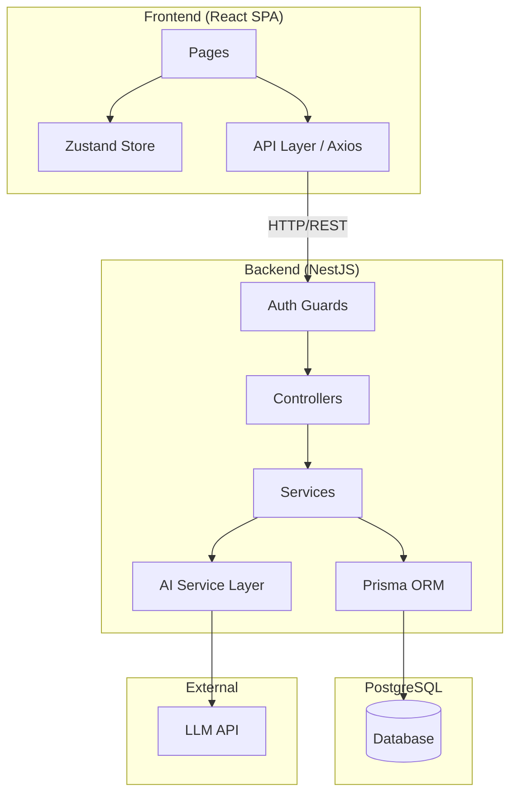
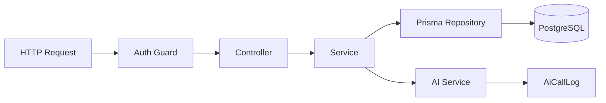
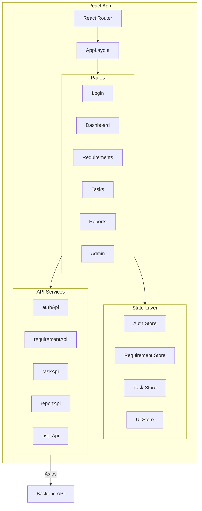
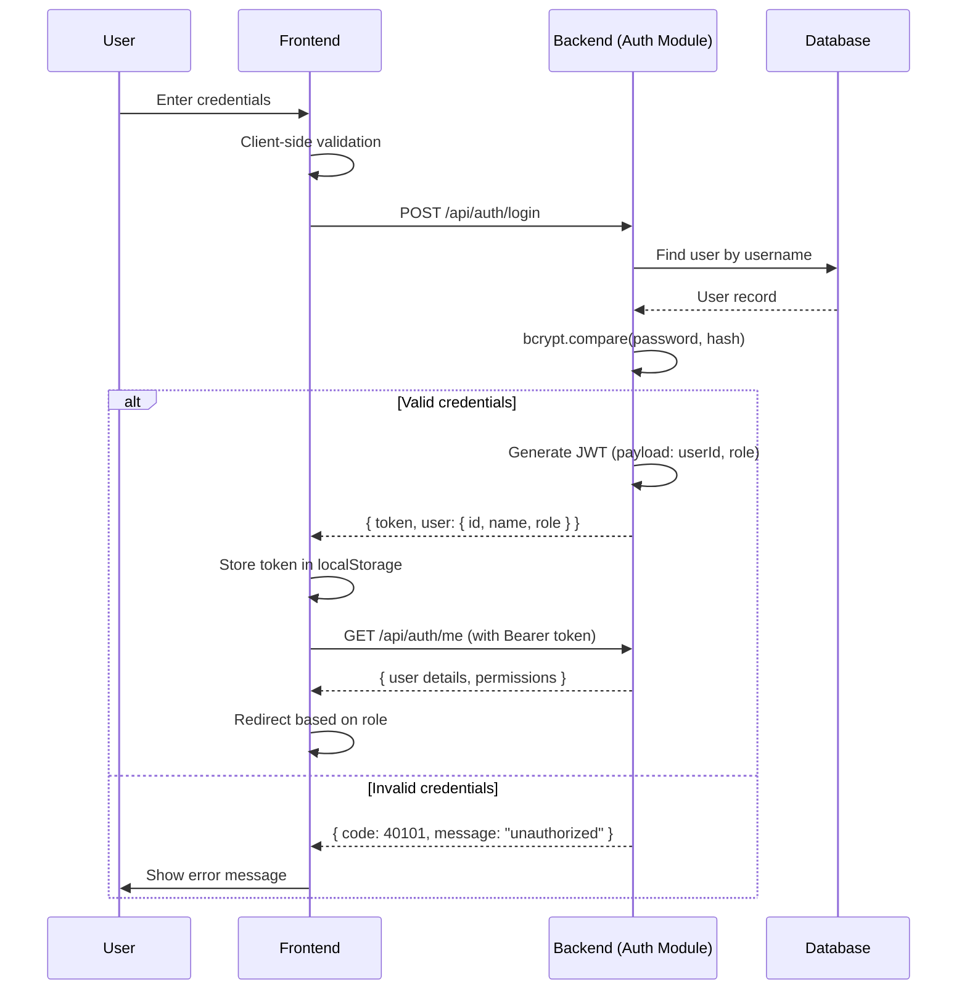
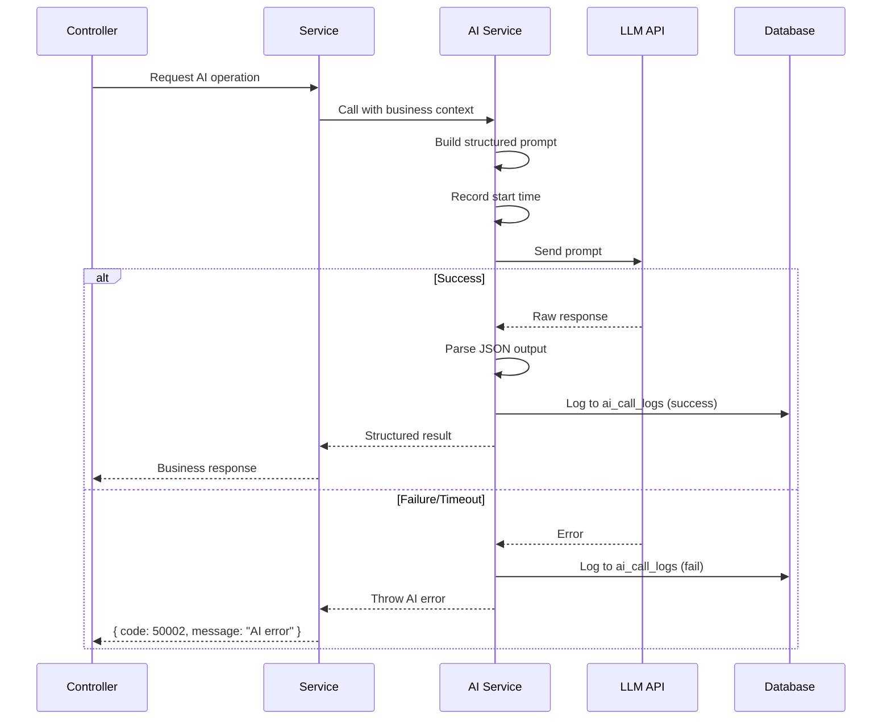
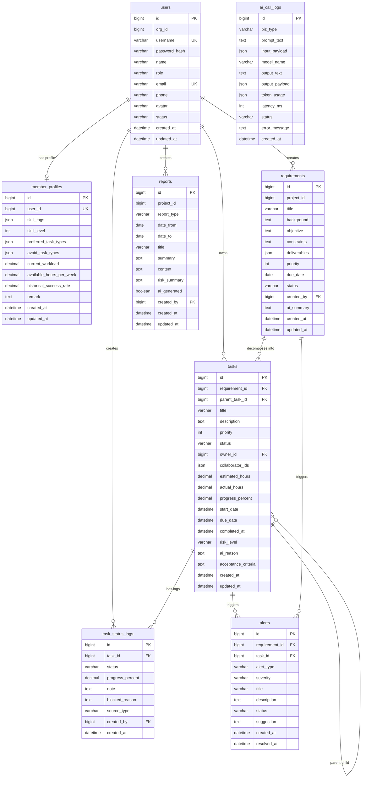

# Design Document: YourBot MVP

## Overview

YourBot MVP 是一个面向团队管理者的 Web 管理仪表盘，核心流程为：**登录/权限 → 需求创建 → AI 拆解 → 任务分配建议 → 任务下发 → 进度看板 → 报告生成**。

系统采用前后端分离架构，前端使用 React + TypeScript + Ant Design 构建 SPA，后端使用 NestJS + Prisma + PostgreSQL 提供 RESTful API，AI 能力通过独立封装的 aiService 层提供任务拆解、分配建议和报告生成三大能力。

### Design Decisions

| Decision | Choice | Rationale |
|----------|--------|-----------|
| Frontend Framework | React + TypeScript + Vite | 成熟生态，TypeScript 提供类型安全，Vite 提供快速开发体验 |
| UI Library | Ant Design | 企业级管理后台组件丰富，表格/表单/看板支持完善 |
| State Management | Zustand | 轻量、TypeScript 友好、无 boilerplate |
| Backend Framework | NestJS | 模块化架构、依赖注入、装饰器模式适合企业应用 |
| ORM | Prisma | 类型安全、迁移管理、直观的 schema 定义 |
| Database | PostgreSQL | JSON 字段支持、事务可靠性、扩展性 |
| Auth | JWT + bcrypt | 无状态认证、标准化、前后端分离友好 |
| AI Integration | 独立 aiService 层 | 解耦 AI 调用逻辑，便于模型切换和 prompt 迭代 |

## Architecture

### High-Level Architecture



### Backend Service Layering



**Layer Responsibilities:**

1. **Controller Layer**: 接收请求、参数校验（class-validator/Zod）、调用 Service、统一响应格式
2. **Service Layer**: 业务逻辑、状态流转、数据聚合、调用 AI Service
3. **Repository/ORM Layer (Prisma)**: 数据库读写、分页查询、事务控制
4. **AI Service Layer**: Prompt 构造、模型调用、结果解析（JSON）、调用日志记录

### Frontend Architecture



### Authentication Flow



### AI Service Integration Pattern



## Components and Interfaces

### Backend Modules

#### Auth Module
```typescript
// auth.controller.ts
@Controller('api/auth')
class AuthController {
  @Post('login')
  login(dto: LoginDto): Promise<ApiResponse<LoginResponseData>>
  
  @Get('me')
  @UseGuards(JwtAuthGuard)
  getMe(user: JwtPayload): Promise<ApiResponse<UserProfileData>>
  
  @Post('logout')
  @UseGuards(JwtAuthGuard)
  logout(): Promise<ApiResponse<null>>
}

// auth.service.ts
class AuthService {
  validateUser(username: string, password: string): Promise<User | null>
  generateToken(user: User): string
  hashPassword(password: string): Promise<string>
}
```

#### Requirements Module
```typescript
// requirements.controller.ts
@Controller('api/requirements')
@UseGuards(JwtAuthGuard)
class RequirementsController {
  @Post()
  @Roles('manager', 'admin')
  create(dto: CreateRequirementDto): Promise<ApiResponse<{ id: number; status: string }>>
  
  @Get()
  findAll(query: RequirementQueryDto): Promise<ApiResponse<PaginatedList<Requirement>>>
  
  @Get(':id')
  findOne(id: number): Promise<ApiResponse<RequirementDetail>>
  
  @Put(':id')
  @Roles('manager', 'admin')
  update(id: number, dto: UpdateRequirementDto): Promise<ApiResponse<Requirement>>
  
  @Post(':id/split')
  @Roles('manager', 'admin')
  split(id: number, dto: SplitRequirementDto): Promise<ApiResponse<SplitResult>>
}
```

#### Tasks Module
```typescript
// tasks.controller.ts
@Controller('api/tasks')
@UseGuards(JwtAuthGuard)
class TasksController {
  @Get()
  findAll(query: TaskQueryDto): Promise<ApiResponse<PaginatedList<Task>>>
  
  @Get(':id')
  findOne(id: number): Promise<ApiResponse<TaskDetail>>
  
  @Post(':id/status')
  updateStatus(id: number, dto: UpdateTaskStatusDto): Promise<ApiResponse<{ task_id: number; status: string }>>
  
  @Post('assignment-suggest')
  @Roles('manager', 'admin')
  suggestAssignment(dto: AssignmentSuggestDto): Promise<ApiResponse<AssignmentSuggestions>>
  
  @Post('assign')
  @Roles('manager', 'admin')
  assign(dto: AssignTasksDto): Promise<ApiResponse<{ assigned_count: number; task_ids: number[] }>>
}
```

#### AI Module
```typescript
// ai.service.ts
class AiService {
  splitRequirement(requirement: Requirement, options: SplitOptions): Promise<SplitResult>
  suggestAssignment(tasks: TaskInfo[], members: MemberProfile[]): Promise<AssignmentSuggestion[]>
  generateReport(context: ReportContext): Promise<ReportContent>
  
  // Internal
  private buildPrompt(template: string, context: Record<string, any>): string
  private callModel(prompt: string, bizType: string): Promise<string>
  private parseStructuredOutput<T>(raw: string, schema: ZodSchema<T>): T
  private logCall(params: AiCallLogParams): Promise<void>
}
```

#### Dashboard Module
```typescript
// dashboard.controller.ts
@Controller('api/dashboard')
@UseGuards(JwtAuthGuard)
class DashboardController {
  @Get('board')
  @Roles('manager', 'admin')
  getBoard(query: BoardQueryDto): Promise<ApiResponse<BoardData>>
}
```

#### Reports Module
```typescript
// reports.controller.ts
@Controller('api/reports')
@UseGuards(JwtAuthGuard)
class ReportsController {
  @Post('generate')
  @Roles('manager', 'admin')
  generate(dto: GenerateReportDto): Promise<ApiResponse<Report>>
  
  @Get()
  findAll(query: ReportQueryDto): Promise<ApiResponse<PaginatedList<Report>>>
  
  @Get(':id')
  findOne(id: number): Promise<ApiResponse<Report>>
  
  @Put(':id')
  @Roles('manager', 'admin')
  update(id: number, dto: UpdateReportDto): Promise<ApiResponse<Report>>
}
```

#### Alerts Module
```typescript
// alerts.service.ts
class AlertsService {
  detectDelayedTasks(): Promise<Alert[]>
  detectBlockedTasks(thresholdHours: number): Promise<Alert[]>
  detectOverloadedMembers(): Promise<Alert[]>
  resolveAlert(alertId: number): Promise<void>
}
```

### Frontend Components

#### API Layer (Axios)
```typescript
// api/client.ts
const apiClient = axios.create({
  baseURL: '/api',
  timeout: 30000,
})

// Request interceptor: attach JWT token
// Response interceptor: unified error handling, 40101 -> redirect to login

// api/auth.ts
export const authApi = {
  login: (data: LoginParams) => apiClient.post<ApiResponse<LoginData>>('/auth/login', data),
  getMe: () => apiClient.get<ApiResponse<UserProfile>>('/auth/me'),
  logout: () => apiClient.post('/auth/logout'),
}
```

#### Zustand Stores
```typescript
// store/authStore.ts
interface AuthState {
  token: string | null
  user: UserProfile | null
  isAuthenticated: boolean
  login: (params: LoginParams) => Promise<void>
  logout: () => void
  fetchMe: () => Promise<void>
}

// store/taskStore.ts
interface TaskState {
  tasks: Task[]
  boardData: BoardData | null
  loading: boolean
  fetchTasks: (query: TaskQuery) => Promise<void>
  fetchBoard: (query: BoardQuery) => Promise<void>
  updateTaskStatus: (taskId: number, dto: UpdateStatusDto) => Promise<void>
}
```

#### Page Components
| Page | Route | Key Components |
|------|-------|----------------|
| Login | `/login` | LoginForm |
| Dashboard | `/dashboard` | OverviewCards, TaskStatusChart, MemberLoadList, AlertList |
| Requirements | `/requirements` | RequirementFilterBar, RequirementTable, RequirementFormDrawer |
| AI Split | `/requirements/:id/split` | RequirementSummaryCard, TaskTreeView, TaskEditDrawer |
| Assignment | `/tasks/assignment` | TaskAssignmentTable, MemberRecommendCard, AssignConfirmDialog |
| Kanban Board | `/tasks/board` | FilterBar, KanbanBoard, KanbanColumn, TaskCard |
| Task Detail | `/tasks/:id` | TaskDetailHeader, TaskMetaCard, StatusTimeline |
| My Tasks | `/tasks/my` | MyTaskSummary, MyTaskList, TaskQuickUpdateForm |
| Reports | `/reports` | ReportFilterBar, ReportList, ReportEditor, ReportPreview |
| Admin Users | `/admin/users` | UserTable, UserFormDrawer, MemberProfileEditor |

### Shared Interfaces

```typescript
// Unified API Response
interface ApiResponse<T> {
  code: number        // 0=success, 40001=validation, 40101=unauthorized, etc.
  message: string
  data: T
  request_id: string
}

// Pagination
interface PaginatedList<T> {
  list: T[]
  pagination: {
    page: number
    page_size: number
    total: number
  }
}

// Pagination Query
interface PaginationQuery {
  page?: number       // default: 1
  page_size?: number  // default: 20
}
```

## Data Models

### Entity Relationship Diagram



### Prisma Schema (Key Models)

```prisma
model User {
  id           BigInt   @id @default(autoincrement())
  orgId        BigInt?  @map("org_id")
  username     String   @unique @db.VarChar(64)
  passwordHash String   @map("password_hash") @db.VarChar(255)
  name         String   @db.VarChar(64)
  role         String   @db.VarChar(20) // admin | manager | member
  email        String   @unique @db.VarChar(128)
  phone        String?  @db.VarChar(32)
  avatar       String?  @db.VarChar(255)
  status       String   @default("active") @db.VarChar(20) // active | disabled
  createdAt    DateTime @default(now()) @map("created_at")
  updatedAt    DateTime @updatedAt @map("updated_at")

  profile      MemberProfile?
  requirements Requirement[]
  tasks        Task[]         @relation("TaskOwner")
  reports      Report[]
  statusLogs   TaskStatusLog[]

  @@map("users")
}

model MemberProfile {
  id                    BigInt   @id @default(autoincrement())
  userId                BigInt   @unique @map("user_id")
  skillTags             Json?    @map("skill_tags")
  skillLevel            Int?     @map("skill_level")
  preferredTaskTypes    Json?    @map("preferred_task_types")
  avoidTaskTypes        Json?    @map("avoid_task_types")
  currentWorkload       Decimal? @map("current_workload") @db.Decimal(5, 2)
  availableHoursPerWeek Decimal? @map("available_hours_per_week") @db.Decimal(6, 2)
  historicalSuccessRate Decimal? @map("historical_success_rate") @db.Decimal(5, 2)
  remark                String?  @db.Text
  createdAt             DateTime @default(now()) @map("created_at")
  updatedAt             DateTime @updatedAt @map("updated_at")

  user User @relation(fields: [userId], references: [id])

  @@map("member_profiles")
}

model Requirement {
  id           BigInt   @id @default(autoincrement())
  projectId    BigInt?  @map("project_id")
  title        String   @db.VarChar(255)
  background   String   @db.Text
  objective    String   @db.Text
  constraints  String?  @db.Text
  deliverables Json
  priority     Int      // 1=critical, 2=high, 3=medium, 4=low
  dueDate      DateTime @map("due_date") @db.Date
  status       String   @default("draft") @db.VarChar(30)
  createdBy    BigInt   @map("created_by")
  aiSummary    String?  @map("ai_summary") @db.Text
  createdAt    DateTime @default(now()) @map("created_at")
  updatedAt    DateTime @updatedAt @map("updated_at")

  creator User   @relation(fields: [createdBy], references: [id])
  tasks   Task[]
  alerts  Alert[]

  @@map("requirements")
}

model Task {
  id                 BigInt    @id @default(autoincrement())
  requirementId      BigInt    @map("requirement_id")
  parentTaskId       BigInt?   @map("parent_task_id")
  title              String    @db.VarChar(255)
  description        String?   @db.Text
  priority           Int?
  status             String    @default("todo") @db.VarChar(30)
  ownerId            BigInt?   @map("owner_id")
  collaboratorIds    Json?     @map("collaborator_ids")
  estimatedHours     Decimal?  @map("estimated_hours") @db.Decimal(8, 2)
  actualHours        Decimal?  @map("actual_hours") @db.Decimal(8, 2)
  progressPercent    Decimal?  @default(0) @map("progress_percent") @db.Decimal(5, 2)
  startDate          DateTime? @map("start_date")
  dueDate            DateTime? @map("due_date")
  completedAt        DateTime? @map("completed_at")
  riskLevel          String?   @map("risk_level") @db.VarChar(20)
  aiReason           String?   @map("ai_reason") @db.Text
  acceptanceCriteria String?   @map("acceptance_criteria") @db.Text
  createdAt          DateTime  @default(now()) @map("created_at")
  updatedAt          DateTime  @updatedAt @map("updated_at")

  requirement Requirement     @relation(fields: [requirementId], references: [id])
  owner       User?           @relation("TaskOwner", fields: [ownerId], references: [id])
  parentTask  Task?           @relation("TaskHierarchy", fields: [parentTaskId], references: [id])
  childTasks  Task[]          @relation("TaskHierarchy")
  statusLogs  TaskStatusLog[]
  alerts      Alert[]

  @@map("tasks")
}

model TaskStatusLog {
  id              BigInt   @id @default(autoincrement())
  taskId          BigInt   @map("task_id")
  status          String   @db.VarChar(30)
  progressPercent Decimal? @map("progress_percent") @db.Decimal(5, 2)
  note            String?  @db.Text
  blockedReason   String?  @map("blocked_reason") @db.Text
  sourceType      String?  @map("source_type") @db.VarChar(30)
  createdBy       BigInt   @map("created_by")
  createdAt       DateTime @default(now()) @map("created_at")

  task    Task @relation(fields: [taskId], references: [id])
  creator User @relation(fields: [createdBy], references: [id])

  @@map("task_status_logs")
}

model Alert {
  id            BigInt    @id @default(autoincrement())
  requirementId BigInt?   @map("requirement_id")
  taskId        BigInt?   @map("task_id")
  alertType     String    @map("alert_type") @db.VarChar(30)
  severity      String    @db.VarChar(20)
  title         String    @db.VarChar(255)
  description   String?   @db.Text
  status        String    @default("open") @db.VarChar(20)
  suggestion    String?   @db.Text
  createdAt     DateTime  @default(now()) @map("created_at")
  resolvedAt    DateTime? @map("resolved_at")

  requirement Requirement? @relation(fields: [requirementId], references: [id])
  task        Task?        @relation(fields: [taskId], references: [id])

  @@map("alerts")
}

model Report {
  id          BigInt   @id @default(autoincrement())
  projectId   BigInt?  @map("project_id")
  reportType  String   @map("report_type") @db.VarChar(20)
  dateFrom    DateTime @map("date_from") @db.Date
  dateTo      DateTime @map("date_to") @db.Date
  title       String   @db.VarChar(255)
  summary     String?  @db.Text
  content     String?  @db.Text
  riskSummary String?  @map("risk_summary") @db.Text
  aiGenerated Boolean  @default(false) @map("ai_generated")
  createdBy   BigInt   @map("created_by")
  createdAt   DateTime @default(now()) @map("created_at")
  updatedAt   DateTime @updatedAt @map("updated_at")

  creator User @relation(fields: [createdBy], references: [id])

  @@map("reports")
}

model AiCallLog {
  id            BigInt   @id @default(autoincrement())
  bizType       String   @map("biz_type") @db.VarChar(50)
  promptText    String?  @map("prompt_text") @db.Text
  inputPayload  Json?    @map("input_payload")
  modelName     String   @map("model_name") @db.VarChar(100)
  outputText    String?  @map("output_text") @db.Text
  outputPayload Json?    @map("output_payload")
  tokenUsage    Json?    @map("token_usage")
  latencyMs     Int?     @map("latency_ms")
  status        String   @db.VarChar(20) // success | fail
  errorMessage  String?  @map("error_message") @db.Text
  createdAt     DateTime @default(now()) @map("created_at")

  @@map("ai_call_logs")
}
```

### Key Data Constraints

| Constraint | Rule |
|-----------|------|
| User.role | ENUM: `admin`, `manager`, `member` |
| User.status | ENUM: `active`, `disabled` |
| Requirement.status | ENUM: `draft`, `analyzing`, `split_done`, `assigned`, `in_progress`, `closed` |
| Requirement.priority | INT: 1 (critical), 2 (high), 3 (medium), 4 (low) |
| Task.status | ENUM: `todo`, `doing`, `blocked`, `done`, `delayed` |
| Task.progress_percent | DECIMAL: 0.00 - 100.00 |
| Alert.alert_type | ENUM: `delay`, `blocked`, `no_update`, `overload`, `missing_dependency` |
| Alert.severity | ENUM: `low`, `medium`, `high`, `critical` |
| Report.report_type | ENUM: `daily`, `weekly`, `stage` |
| Username | UNIQUE across all users |
| Email | UNIQUE across all users |
| MemberProfile.user_id | UNIQUE (one profile per user) |

## Correctness Properties

*A property is a characteristic or behavior that should hold true across all valid executions of a system—essentially, a formal statement about what the system should do. Properties serve as the bridge between human-readable specifications and machine-verifiable correctness guarantees.*

### Property 1: Valid login returns token and role

*For any* valid user in the system with correct credentials, the login endpoint SHALL return a non-empty JWT token and the user's role matching their stored role in the database.

**Validates: Requirements 1.1**

### Property 2: Invalid credentials rejected uniformly

*For any* invalid credential combination (wrong username, wrong password, or both), the login endpoint SHALL return an unauthorized error without revealing which specific field is incorrect—the error response must be identical regardless of which field is wrong.

**Validates: Requirements 1.2**

### Property 3: Role-based endpoint access control

*For any* authenticated user with a given role and any API endpoint, the system SHALL grant access if and only if the endpoint is in the set of permitted endpoints for that role. Admin accesses user management; manager accesses requirements, tasks, kanban, reports; member accesses only task viewing and status updates.

**Validates: Requirements 1.3, 1.5, 1.6, 1.7**

### Property 4: Invalid token rejection

*For any* expired, malformed, or tampered JWT token, the system SHALL reject the request with error code 40101.

**Validates: Requirements 1.4**

### Property 5: Requirement creation round-trip

*For any* valid requirement data (all required fields present, valid priority, future due_date), creating the requirement and then reading it back SHALL return the same field values with a valid unique identifier.

**Validates: Requirements 2.1**

### Property 6: Requirement validation rejects invalid input

*For any* requirement submission with missing required fields, invalid priority value (not in critical/high/medium/low), or past due_date, the system SHALL reject with error code 40001 specifying the validation failure.

**Validates: Requirements 2.2, 2.5, 2.6**

### Property 7: List filtering and sorting correctness

*For any* set of requirements in the database and any combination of filter parameters (status, priority) and sort parameters (created_at, due_date), the returned paginated list SHALL contain only items matching all filter criteria, in the correct sort order, with accurate pagination metadata.

**Validates: Requirements 2.3**

### Property 8: AI call logging completeness

*For any* AI service invocation (decomposition, assignment suggestion, or report generation), regardless of success or failure, the system SHALL create an AiCallLog entry containing non-null prompt_text, model_name, latency_ms, and status fields.

**Validates: Requirements 3.5, 4.3, 8.5**

### Property 9: AI failure returns 50002 and logs error

*For any* AI service failure (timeout, model error, parse failure), the system SHALL return error code 50002 to the caller AND create an AiCallLog entry with status="fail" and a non-empty error_message.

**Validates: Requirements 3.6, 4.4, 8.6**

### Property 10: Task tree not persisted until confirmed

*For any* AI decomposition result, the tasks table SHALL contain no new entries from that decomposition until the manager explicitly confirms. The split endpoint returns task data without database persistence.

**Validates: Requirements 3.2**

### Property 11: Confirmed task tree preserves parent-child relationships

*For any* confirmed task tree with N tasks and parent-child relationships, after persistence, reading back all tasks for that requirement SHALL yield exactly N tasks with the same parent-child structure (parent_task_id references are correct).

**Validates: Requirements 3.3**

### Property 12: Assignment suggestions complete with reasoning

*For any* set of tasks and member profiles, the assignment suggestion endpoint SHALL return a recommendation for each input task, where each recommendation includes a non-empty recommended_owner_id and a non-empty reason string.

**Validates: Requirements 4.1, 4.2**

### Property 13: Task assignment updates state correctly

*For any* valid task assignment (existing task, active member), after assignment the task SHALL have owner_id set to the assigned member, status set to "todo", and a non-null assignment timestamp.

**Validates: Requirements 5.1**

### Property 14: Batch assignment atomicity

*For any* batch of task assignments where at least one assignment is invalid (non-existent or disabled member), the entire batch SHALL be rejected and no task in the batch SHALL have its owner_id modified.

**Validates: Requirements 5.3, 5.4**

### Property 15: Task status transition validation and logging

*For any* task status update: (a) invalid status values are rejected, (b) status "blocked" without a blocked_reason is rejected, (c) status "done" sets completed_at and progress_percent=100, (d) progress_percent outside [0,100] is rejected, and (e) every accepted status change creates a TaskStatusLog with previous status, new status, progress, and creator.

**Validates: Requirements 6.1, 6.2, 6.3, 6.4, 6.5**

### Property 16: Task status update permission enforcement

*For any* user attempting to update a task's status, the update SHALL be accepted only if the user is the task's owner OR has role manager or admin. All other users SHALL receive a 40301 forbidden error.

**Validates: Requirements 6.6**

### Property 17: Kanban board grouping correctness

*For any* set of tasks with various statuses, the board endpoint SHALL return each task in exactly one column matching its current status, and applying any filter (requirement_id, owner_id) SHALL return only tasks matching that filter.

**Validates: Requirements 7.1, 7.3, 7.4**

### Property 18: Alert detection correctness

*For any* task past its due_date with status not "done", the alert detection SHALL create a "delay" alert. *For any* task in "blocked" status for more than 24 hours, it SHALL create a "blocked" alert. *For any* member whose assigned task hours exceed available_hours_per_week, it SHALL create an "overload" alert.

**Validates: Requirements 9.4, 9.5, 9.6**

### Property 19: User uniqueness constraint

*For any* attempt to create a user with a username or email that already exists in the system, the creation SHALL be rejected with a validation error, regardless of other field values.

**Validates: Requirements 10.4**

### Property 20: Deactivated user cannot authenticate

*For any* user whose status is set to "disabled", login attempts with their correct credentials SHALL be rejected, while their historical data (tasks, logs, reports) SHALL remain accessible to authorized users.

**Validates: Requirements 10.3**

### Property 21: API response format invariant

*For any* API endpoint call (success or failure), the response SHALL contain exactly the fields: code (number), message (string), data (object or null), and request_id (unique string). List endpoints SHALL support page/page_size parameters with defaults of 1 and 20 respectively.

**Validates: Requirements 11.1, 11.3, 11.4**

## Error Handling

### Backend Error Strategy

| Layer | Error Type | Handling |
|-------|-----------|----------|
| Controller | Validation errors | class-validator/Zod throws → caught by global exception filter → 40001 |
| Guard | Auth errors | JWT validation fails → 40101; Role check fails → 40301 |
| Service | Business logic errors | Custom exceptions (NotFoundException → 40401, etc.) |
| AI Service | AI failures | Timeout/parse errors → logged to AiCallLog → 50002 |
| Prisma | DB errors | Unique constraint → 40001; Connection errors → 50001 |

### Global Exception Filter

```typescript
@Catch()
class GlobalExceptionFilter implements ExceptionFilter {
  catch(exception: unknown, host: ArgumentsHost) {
    // Map exception type to error code
    // Generate request_id (UUID v4)
    // Return unified { code, message, data, request_id }
    // Log server errors (50001, 50002)
  }
}
```

### Frontend Error Handling

| Scenario | Handling |
|----------|----------|
| 40101 (Unauthorized) | Clear token, redirect to `/login` |
| 40301 (Forbidden) | Show "无访问权限" message, offer return to dashboard |
| 40001 (Validation) | Display field-level error messages on form |
| 40401 (Not Found) | Show "资源不存在" with back navigation |
| 50001/50002 (Server/AI) | Show error toast with retry button |
| Network error | Show "网络异常，请稍后重试" |

### AI Service Error Handling

```typescript
class AiService {
  private async callModel(prompt: string, bizType: string): Promise<string> {
    const startTime = Date.now()
    try {
      const response = await this.httpService.post(modelEndpoint, { prompt }, {
        timeout: 60000 // 60s timeout for AI calls
      })
      await this.logCall({ bizType, status: 'success', latencyMs: Date.now() - startTime, ... })
      return response.data
    } catch (error) {
      await this.logCall({ bizType, status: 'fail', errorMessage: error.message, ... })
      throw new AiServiceException('AI service unavailable')
    }
  }
}
```

## Testing Strategy

### Testing Approach

This project uses a **dual testing approach**:

1. **Property-based tests** (using [fast-check](https://github.com/dubzzz/fast-check) for TypeScript): Verify universal properties across generated inputs. Minimum 100 iterations per property test.
2. **Unit tests** (using Jest): Verify specific examples, edge cases, integration points, and UI behavior.
3. **Integration tests** (using Supertest + Jest): Verify API endpoint behavior end-to-end with a test database.

### Property-Based Testing Configuration

- **Library**: fast-check (TypeScript)
- **Minimum iterations**: 100 per property
- **Tag format**: `Feature: yourbot-mvp, Property {N}: {property_text}`
- Each correctness property (1-21) maps to one property-based test

### Test Organization

```
backend/
  src/
    modules/
      auth/
        auth.service.spec.ts          # Unit tests
        auth.controller.spec.ts       # Unit tests
        auth.property.spec.ts         # Property tests (Properties 1-4)
      requirements/
        requirements.service.spec.ts
        requirements.property.spec.ts # Property tests (Properties 5-7)
      tasks/
        tasks.service.spec.ts
        tasks.property.spec.ts        # Property tests (Properties 13-17)
      ai/
        ai.service.spec.ts
        ai.property.spec.ts           # Property tests (Properties 8-12)
      alerts/
        alerts.property.spec.ts       # Property tests (Property 18)
      dashboard/
        dashboard.property.spec.ts    # Property tests (Property 17)
      reports/
        reports.service.spec.ts
      users/
        users.property.spec.ts        # Property tests (Properties 19-20)
    common/
      response.property.spec.ts       # Property tests (Property 21)
  test/
    e2e/                              # Integration tests (Supertest)
frontend/
  src/
    __tests__/                        # Component and hook tests (Jest + React Testing Library)
```

### Unit Test Focus Areas

- Specific login scenarios (correct/incorrect credentials)
- Requirement form validation edge cases
- Task state machine transitions (valid/invalid paths)
- AI response parsing with malformed JSON
- Report Markdown export formatting
- Frontend component rendering and interaction

### Integration Test Focus Areas

- Full authentication flow (login → access → logout)
- Requirement creation → AI split → confirm → task creation pipeline
- Task assignment → status update → board reflection
- Report generation → edit → export pipeline
- Permission enforcement across all endpoints

